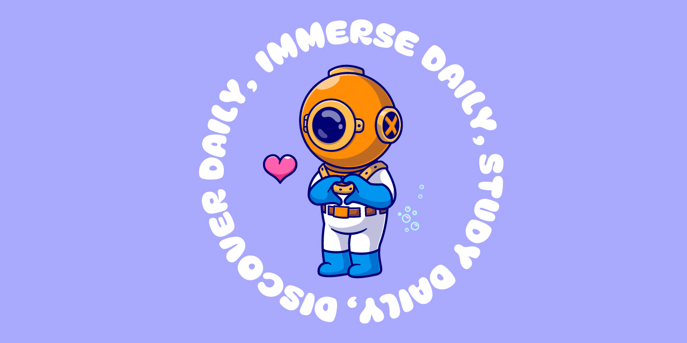
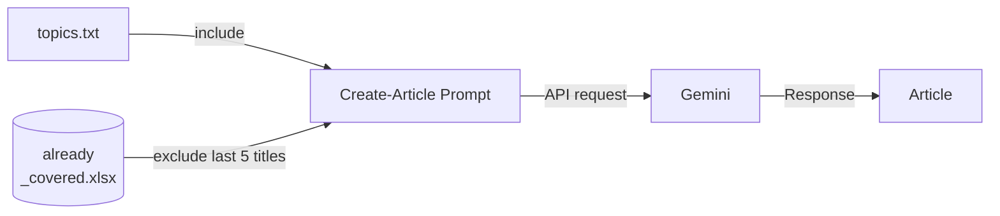
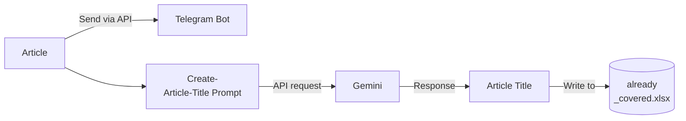

# Daily Immersion
*Use Gemini API + Telegram Bot to receive daily customized articles*

<a href="https://www.freepik.com/free-vector/cute-diver-love-heart-sign-cartoon-vector-icon-illustration-science-holiday-icon-isolated-flat_152549271.htm#query=diver&position=0&from_view=keyword&track=sph&uuid=ac7bba2b-8e25-4dff-8228-dc76cd36c66d">Image by catalyststuff</a> on Freepik
## Why
I like to surround myself with the topics that I am studying because it helps me to increase my interest and to learn faster. I have built this small project to satisfy a specific need that has become very urgent since I finished
university and started to self-define my learning path. I need daily articles focused on the subjects that I am studying, with very specific filters. This tool will be part of my daily immersion in the topics that I find interesting.

Immersion is actually a technique used to learn a new language:

*Language immersion, or simply immersion, is a technique used in bilingual language education in which two languages are used for instruction in a variety of topics, including math, science, or social studies* ([Wikipedia](https://en.wikipedia.org/wiki/Language_immersion)).

## How
### Overview

### Procedure
1. [Create Gemini API key](https://aistudio.google.com/app/apikey) (if you are re-directed to the page `https://ai.google.dev/gemini-api/docs/available-regions` Gemini API is not available for your country yet)
2. [Create Telegram Bot](https://www.directual.com/lesson-library/how-to-create-a-telegram-bot), annotate and write token in telegram_bot.json
3. Navigate to `https://api.telegram.org/bot<YourBOTToken>/getUpdates` annotate and write chat_id (under the key message['chat']['id']) in telegram_bot.json
4. Schedule main.py ([pythonanywhere](https://www.pythonanywhere.com) allows to schedule one file for free)
